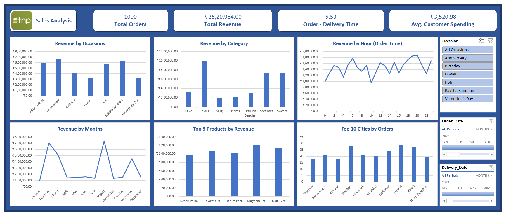

> # Ferns and Petals Sales Analysis

## Overview
This project analyzes sales data from Ferns and Petals to understand product performance and seasonal sales trends. The analysis helps identify high-demand products and revenue-generating periods.

## Dataset
The project uses **multiple sales datasets containing product orders, customer details, and revenue data**.

## Tools & Technologies
- Excel

## Project Workflow
1. Data cleaning and preparation.
2. Data transformation using Excel functions.
3. Dashboard creation for sales insights.

## Key Insights
- Identified **top-selling product categories**.
- Observed **seasonal demand patterns**.
- Analyzed **revenue trends over time**.

## Dashboard

